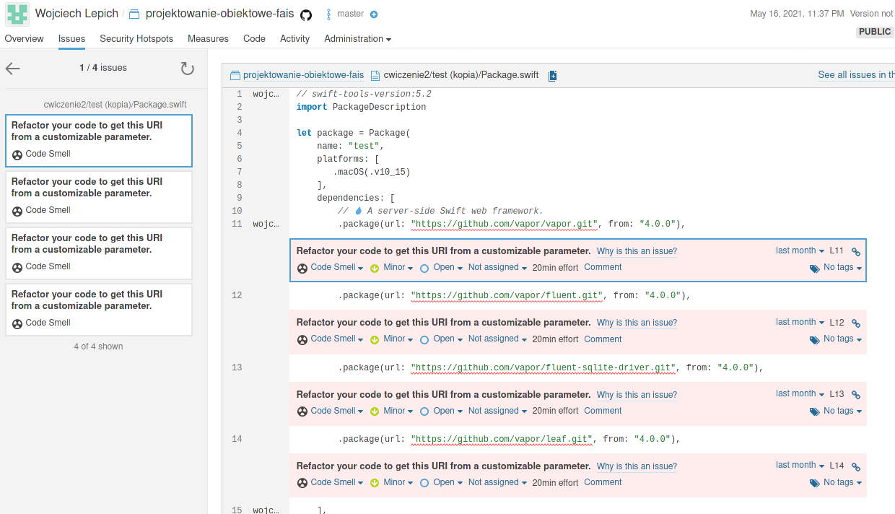

# SonarCloud

After fixing there were 4 issues left - all with hardcoded URI in Package.swift. I haven't found any way to move it to a some kind of configuration file.

---

Before scanning:

Example issues

After fixing.

